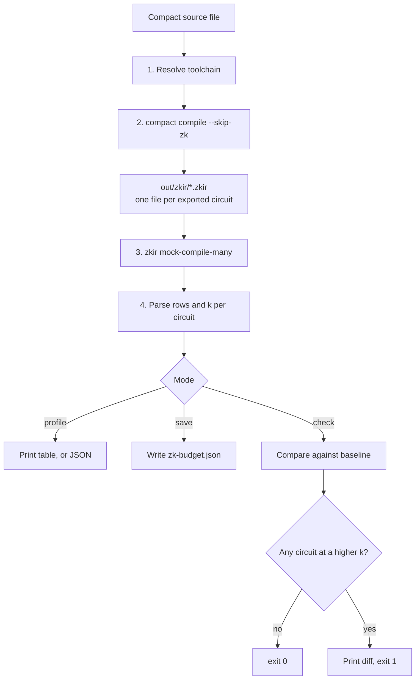
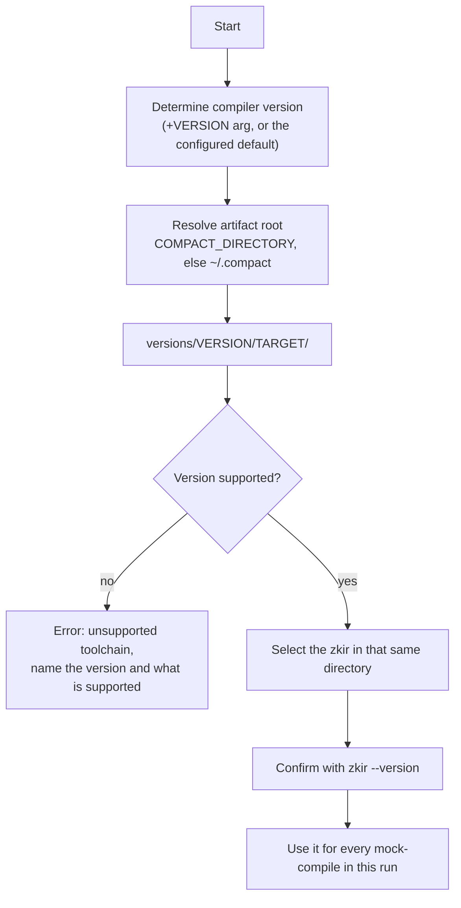
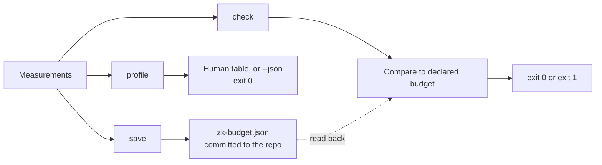

# nite-zk-profiler

See what a Compact circuit costs to prove, while you are still writing it.

No proving keys. No real proof. A small contract reports in under a second, and a thirteen circuit production contract in about thirty, nearly all of which is the Compact compiler itself. Measuring the same contract by generating proving keys takes far longer.

> Every number and command output in this document was captured from a real toolchain run on Compact 0.31.1, not invented. See [Verified mechanism](#verified-mechanism) for the raw evidence.

## The problem

Proving cost does not rise smoothly with circuit size. It rises in steps.

Every circuit is assigned a `k`. The prover works over `2^k` rows, and everything you pay for, proving time and peak memory, is set by `k`. Each step up in `k` roughly doubles the bill.

The trap is that **`k` is not a function of how much code you wrote.** It is set by which ledger operations and witness calls your circuit performs, and by the shape of the data they touch. Measured on real circuits:

| circuit | what it does | rows | k | relative cost |
| --- | --- | --- | --- | --- |
| `bump` | one Counter increment | 24 | 5 | 1x |
| `manyIncrements` | twelve Counter increments | 24 | 7 | 4x |
| `justAdd` | Counter increment with a cast | 191 | 8 | 8x |
| `justCompare` | one Boolean write from one comparison | 119 | 9 | 16x |
| `balanceOf` | one Map lookup | 305 | 9 | 16x |
| `register` | Map insert plus Counter increment | 368 | 9 | 16x |
| `insert32` | one MerkleTree insert | 2299 | 13 | 256x |
| `prove32` | one MerkleTree path check, depth 32 | 3551 | 13 | 256x |

Read that table twice. `manyIncrements` does twelve times the work of `bump` in exactly the same 24 rows, and still costs four times as much to prove. `justCompare` writes a single boolean and costs sixteen times `bump`. `justAdd` uses more rows than `justCompare` and costs half as much. Touching a MerkleTree at all costs 256 times a counter increment.

None of this is visible in the source. None of it is proportional to lines of code. And today the only way to find out is to generate proving keys and time a real proof, which is far too slow to sit in an edit loop. So the expensive choice gets made early, silently, and shows up much later as a user facing performance problem.

This tool makes `k` visible while you are still choosing your data model.

## What the tool does

It reports the cost class of every circuit in your contract.

```text
$ nite-zk profile Sample.compact

  circuit     rows   k  capacity  cost  est. prove
  bump          24   5        32    1x        ~10ms
  balanceOf    305   9       512   16x       ~165ms
  register     368   9       512   16x       ~165ms
  insert32    2299  13      8192  256x         ~2.6s

  4 circuits, toolchain 0.31.1, midnight-zkir 2.1.0, 0.9s
  est. prove models prover work as 2^k, on an uncalibrated default. Run `nite-zk calibrate` to anchor it to your prover.
  It excludes network time, and assumes the proving key for that k is already on the prover.
```

`k` is the number that matters. `cost` is `2^k` expressed relative to the cheapest circuit in the contract, so you can see at a glance which circuits dominate your proving budget.

It also supports a committed cost budget, so an unintended increase fails CI instead of shipping:

```text
$ nite-zk check

  transferFunds     k 16   budget 15   over by 1, about 2x
  proveMembership   k 16   budget 16   at budget
  setConfig         k  9   budget  9   at budget

  FAIL: 1 circuit over budget
```

The budget is a ceiling you declare, not a snapshot of the last run. Raising `k` on purpose means raising the ceiling in the same commit, where a reviewer sees it.

## Scope

In scope for this release:

- Per circuit `rows`, `k`, capacity, and relative cost
- `zk-budget.json` declared cost ceilings: write them, and check against them
- Nonzero exit when a circuit exceeds its declared `maxK`, so it drops into CI as one step
- Multi file contracts
- A measured cost reference for Compact constructs, so a developer reading a high `k` knows what to do about it

Explicitly out of scope:

- Per line attribution by ablation. Proposed and deliberately cut. It may be proposed separately later.
- The VS Code extension. The tool is built so an extension could consume its JSON output later, but that is not part of this work.

## Architecture

The tool is a thin, honest wrapper around two programs that already ship with the Compact toolchain. It does not model proving cost itself, it does not reimplement any part of the compiler, and it does not guess. It runs the shipped tools and reads what they report.

### Pipeline



Each stage is described below.

### Stage 1: resolve the toolchain

This is the most important stage in the tool, and the condition that is easiest to get wrong.

`zkir` is not on your `PATH`. It ships inside each installed toolchain version:

```text
~/.compact/versions/0.31.1/x86_64-unknown-linux-musl/
    zkir        (midnight-zkir 2.1.0,     reads IR version 2.0)
    zkir-v3     (midnight-zkir-v3 3.0.0,  reads IR version 3.0)
```

Two binaries, identical command line interfaces, incompatible IR formats. If the profiler ever picks a `zkir` from a different toolchain than the compiler that produced the IR, the results are meaningless or the run breaks outright.

So the binary is always resolved from the version directory of the compiler that actually ran:



Three rules follow, and they are load bearing:

1. **Never resolve `zkir` from `PATH`.** Only from the version directory.
2. **Never fall back to another version.** If the paired binary is missing, that is an error, not a reason to reach for a neighbour.
3. **Refuse unknown versions up front,** naming the version found and the versions supported, rather than producing a number that looks plausible and is wrong.

The failure this prevents is real and it is quiet. Running the v3 binary against v2 IR does not fail cleanly at the start:

```text
$ zkir-v3 mock-compile-many out/zkir
Mock compiling 2 circuits:
  circuit "balanceOf"Error: Unhandled version: 2.0
```

It prints the beginning of a normal, successful looking report, then dies partway through the first circuit. A parser that reads line by line without checking the exit code would report a partial result as a complete one. The tool checks the exit code on every invocation and treats a truncated report as a hard failure.

### Stage 2: compile without proving keys

```text
compact compile --skip-zk <source> <outdir>
```

`--skip-zk` is what makes this fast enough to sit in an edit loop. It produces the intermediate representation and skips proving key generation entirely, which is the slow part.

The output directory looks like this:

```text
out/
    zkir/
        balanceOf.zkir        <- one file per exported circuit
        register.zkir
    compiler/
        contract-info.json
    contract/
        index.js, index.d.ts, index.js.map
```

Only `out/zkir/` matters here. The tool compiles into a temporary directory by default so it never disturbs your project's own build output.

Two failure modes get explicit handling:

- **A contract with no provable circuits emits no `out/zkir/` directory at all.** Circuits that touch neither the ledger nor a witness compile to nothing and need no proof. Running `zkir` at that point produces a bare `Error: No such file or directory`, which explains nothing. The tool detects the empty case first and reports that the contract has no provable circuits.
- **A compile error exits 255** through the launcher, with diagnostics on stdout. Those are surfaced as is rather than being reworded, since the compiler's own messages are better than anything the tool would invent.

### Stage 3: measure

```text
zkir mock-compile-many out/zkir
```

One invocation covers every circuit, and it reports circuit names directly:

```text
Mock compiling 2 circuits:
  circuit "balanceOf" (k=9, rows=305)
  circuit "register" (k=9, rows=368)
```

Two details drive the implementation:

- **This is written to stderr, not stdout.** Reading stdout gives you an empty string and a report with zero circuits. That is a silent wrong answer rather than a crash, so it is worth stating plainly.
- **`mock-compile-many` is preferred over per file `mock-compile`.** The single file form reports the full file path instead of the circuit name, which would leave the tool recovering names from filenames. The batch form gives clean names and costs one process instead of one per circuit.

### Stage 4: analyse

`rows` and `k` are both read from the `zkir` output. **`k` is never computed locally, because it cannot be.**

This is the central design constraint of the tool, and it is worth being precise about. It would be natural to assume `k = ceil(log2(rows))` and derive everything from a row count. The measurements say otherwise:

- `bump` and `manyIncrements` both use **24 rows**, and report **k=5** and **k=7**.
- `justCompare` uses **119 rows** at **k=9**, while `justAdd` uses **191 rows** at **k=8**. More rows, lower `k`.

So any formula mapping rows to `k` is wrong, and a tool built on one would report confident, incorrect costs. `k` comes from `zkir` or it does not come at all.

The same evidence rules out a headroom metric. There is no honest way to say "this circuit has N rows left before its cost doubles," because rows are not what pushes a circuit to the next `k`. Reporting one would be inventing a number.

The only derived value is capacity:

```text
capacity     = 2^k
relative cost = 2^(k - lowest k in this contract)
```

`k` is stable and deterministic per circuit. The same circuit reports the same `k` across reruns, and is unaffected by which other circuits share the contract, which is what makes it sound to use as a committed budget.

### Stage 5: report or gate

Three modes over the same measurement.



**The gate compares against a declared budget, not against the last run.** This distinction is the whole design.

A circuit's `k` going up is not automatically a bug. Adding a MerkleTree for stronger privacy, or an extra commitment for replay protection, raises `k` and is supposed to. A tool that fails the build every time cost rises for a good reason gets switched off within a week, and then it protects nothing.

So `zk-budget.json` records the cost you have consciously accepted:

```json
{
  "toolchain": "0.31.x",
  "circuits": {
    "proveMembership":  { "maxK": 16 },
    "transferFunds": { "maxK": 15 },
    "setConfig": { "maxK": 9 }
  }
}
```

`check` fails only when a circuit exceeds its declared `maxK`. Raising a ceiling on purpose is a one line edit committed alongside the change that caused it:

```diff
-    "transferFunds": { "maxK": 15 }
+    "transferFunds": { "maxK": 16 }
```

That line is the point. It turns a silent 2x proving cost increase into something a reviewer sees and approves, without ever blocking a deliberate design decision. The gate is an acknowledgement mechanism, not a prohibition.

Behavior in the remaining cases:

- **Circuit under budget:** pass, and report the slack so an over generous ceiling is visible.
- **New circuit not in the budget:** pass with a warning by default, fail under `--strict` so mature projects can require every circuit to be declared.
- **Circuit removed from the contract:** pass, with a note that the budget entry is stale.
- **Row growth within the same `k`:** reported, never fails. Rows do not predict `k`, so a row threshold would fire on changes that cost nothing and stay silent on changes that cost sixteen times more.

## Cost model

Every construct below was measured by compiling one factor at a time into an otherwise fixed contract and reading the row delta. Marginal cost per occurrence, on Compact 0.31.1:

| construct | rows each |
| --- | --- |
| `persistentHash<Vector<n, _>>` | `1956 + 1930 * ceil(n/2)`, plus 33 when `n` is odd |
| `persistentCommit<S>` where `S` has `f` fields | same as `persistentHash` of width `f + 1` |
| `MerkleTree.insert` | 1996 |
| `witness` call | 258 |
| `transientHash<Vector<n, _>>` | 22 per element |
| `if / else` block | 31 |
| `if` block | 19 |
| `assert` on a ledger value | 13 |
| ledger read, `Bytes<32>` | 12 |
| `assert` on a public value | 11 |
| ternary | 10 |
| `Map.member`, `Set.member` | 1 |
| `Map.insert`, `Set.insert`, ledger write | 0 |

The spread is four orders of magnitude. One `persistentHash` of four inputs costs more than five hundred asserts.

Validated outside the synthetic probes: removing a single `persistentHash<Vector<4, Bytes<32>>>` from a 26687 row circuit dropped it to 20862, a delta of 5825 rows. The table predicts 5817. That is 0.14% error.

### Choosing between alternatives

The cheap option is often the wrong option. Each lever below is stated with the constraint first, because every one of them has a case where taking it is a correctness or upgrade safety bug rather than a saving.

#### Transient versus persistent hashing

This is the largest cost difference in Compact, and the most dangerous to apply blindly.

| primitive | rows, 2 inputs | returns | guarantee |
| --- | --- | --- | --- |
| `persistentHash` | 3886 | `Bytes<32>` | stable across upgrades, except on devnet |
| `transientHash` | 44 | `Field` | **not** guaranteed stable across upgrades |

The runtime documentation is explicit about which to use, and it is a semantic rule, not a performance one:

- `persistentHash` and `persistentCommit` "should be used to derive state data, and not for consistency checks where avoidable."
- `transientHash` and `transientCommit` "should not be used to derive state data, but can be used for consistency checks."

**The pitfall.** Anything written into ledger state, or compared against a value that outlives the transaction, is state data and must use the persistent form. A replay protection key inserted into a `Set<Bytes<32>>` and checked on a later transaction is state data. Swapping it to `transientHash` makes the contract cheaper and breaks it on the next toolchain upgrade, silently, with no compile error and no failing test until the upgrade lands.

**The trap that looks like a workaround.** `upgradeFromTransient` converts a `Field` back to `Bytes<32>` for 361 rows, so `transientHash` plus `upgradeFromTransient` costs 405 rows against `persistentHash`'s 3886, a tempting 9.6x. Do not read this as a cheap persistent hash. The function upgrades the *representation*, not the *stability guarantee*, and the value is still derived from a hash the documentation says may change between upgrades. The type system will not stop you. Treat this pattern as unsafe for state data unless Midnight documents otherwise.

**A lever that may be safe, not yet demonstrated end to end.** `degradeToTransient` measured at **zero rows** in isolation, and `transientHash` at 44 rows against `persistentHash`'s 3886. That suggests the documented split is also the cheap one: derive state with `persistentHash` once, then degrade for free and run in circuit consistency checks transiently.

Stated precisely, because the distinction matters: what is measured is the cost of each primitive on its own. What is **not** measured is a real circuit rewritten this way and confirmed to produce equivalent results for fewer rows. Treat the pattern as a hypothesis with good supporting numbers, and measure your own circuit before and after rather than trusting the arithmetic.

Two further constraints on the persistent forms: they throw at runtime on data containing `Opaque` types, and `persistentCommit` requires an opening of exactly 32 bytes.

#### Hash arity

Cost steps every two inputs, so widening an even width hash by one is nearly free (33 rows) while widening an odd one is not (1897 rows).

**The pitfall.** Arity is not a free tuning knob. The number and order of inputs define what the hash commits to, so changing arity changes every value it derives. If those values are in ledger state, that is a breaking state migration, not an optimization. And dropping an input to land on a cheaper parity can destroy domain separation and open a collision between two things that were previously distinct. Only spend this when you are adding a genuinely useful binding and the current width happens to be even.

#### Combining hashes

Four `persistentHash<Vector<2>>` calls cost 15544 rows. One `persistentHash<Vector<8>>` over the same eight values costs 9676, a 38% saving.

**The pitfall.** This only applies when the intermediate hashes are not individually needed. If each narrow hash is separately stored, separately compared, or separately disclosed, merging them changes the contract's semantics. Merging is safe with respect to collisions here only because `Vector<n, Bytes<32>>` is fixed width and positional, so there is no concatenation ambiguity. Do not generalise the trick to variable length or attacker influenced inputs.

#### Ledger reads and writes

Writes, `Map.insert` and `Set.insert` all measured at **zero** marginal rows, because they are recorded as public ledger operations rather than proven in circuit. Reads cost 12 rows each, and reading the same field twice pays twice.

**The pitfall, and it is a big one.** Zero *proving* rows does not mean free. This tool measures one cost dimension. Ledger writes still consume on chain state, transaction size, and fees, and a developer who reads "writes are free" here and starts writing liberally to state will pay for it somewhere this tool does not look. The measurement is narrow and true; the conclusion "so write more" does not follow.

Hoisting a repeated read into a local is a real saving, but confirm it is a safe rewrite in your circuit before applying it, since caching a value changes behavior if anything between the two reads could alter what the second one would have seen.

#### Control flow

A ternary costs 10 rows and an `if / else` costs 31. Ternary is genuinely three times cheaper, and both are noise next to a single hash call. Restructuring branches while a `persistentHash` sits in the same circuit is optimising the wrong thing by a factor of roughly four hundred.

> These figures describe Compact 0.31.1 and will move with the toolchain. They are measured, reproducible documentation, not something the tool computes at runtime. Automated attribution of cost back to source constructs is the ablation feature that was cut from this release.

### Multi file contracts

Supported, and requiring no extra configuration. Relative imports resolve against the importing file's directory, so the compiler walks the import graph itself from a single entry point:

```text
src/
    Main.compact          <- entry point, the file you profile
    lib/
        Math.compact      <- import "./lib/Math";
```

Two things follow from how the compiler handles this:

- **An imported file must contain a single `module` definition and nothing else.** A `pragma` or top level `import` in a module file fails with `does not contain a (single) module defintion`.
- **Only the entry contract's exported circuits produce ZKIR.** An imported helper is inlined into whichever circuit calls it, so its cost is attributed to the circuit that actually pays for it. That is the correct behavior for a profiler: you see the true cost of each entry point, helpers included.

## Supported toolchain versions

| Compact toolchain | zkir | Status |
| --- | --- | --- |
| 0.31.x | 2.1.0 (IR 2.0) | Supported, verified on 0.31.1 |
| 0.33.x | not yet released | Committed to support when it lands |

Anything outside this range is rejected with a clear error naming the version found. The tool will not produce a number it cannot stand behind.

## Command line surface

```text
nite-zk profile <source...>   Report rows, k, cost and estimated proving time
nite-zk save <source...>      Write zk-budget.json from current measurements
nite-zk check [<source...>]   Compare against zk-budget.json
nite-zk diff <ref> [<source>] Compare a contract against a git ref
nite-zk calibrate --observed <ms> --at-k <k>
                              Anchor proving estimates to a real proof

  --no-estimate               Hide the modelled proving time column
  --deep                      Also generate real proving keys, and report
                              measured setup time and prover key size
  --json                      Machine readable output
  --out <dir>                 Compile into a specific directory
  --budget <file>             Use a different baseline path
  --strict                    check: fail on circuits missing from the budget
  --replace                   save: overwrite the budget instead of merging
  --no-color                  Plain output (NO_COLOR is honoured too)
  --no-cache                  Ignore cached measurements for this run
  +VERSION                    Pin the Compact toolchain, e.g. +0.31.1
```

### Several contracts at once

Pass more than one entry point, and one budget file covers them all:

```text
$ nite-zk save packages/pool/src/lending.compact packages/mint/src/mint.compact
Wrote zk-budget.json: 2 contracts, 16 circuits
```

`check` then reads every contract back out of the budget, so CI stays one step
whether the repository holds one contract or ten.

Contracts can also be added one at a time. `save` merges into an existing
budget rather than replacing it, and says what it did:

```text
$ nite-zk save packages/mint/src/mint.compact
Wrote /repo/zk-budget.json
  1 contract, 3 circuits
  added:   packages/mint/src/mint.compact
  kept:    packages/pool/src/lending.compact
```

`--replace` writes a fresh file when you do want the old entries gone.

The budget is written relative to the working directory, and `save` prints the
full path it wrote, so running it from the wrong directory is visible
immediately rather than leaving a file somewhere unexpected.

### Comparing against a branch

```text
$ nite-zk diff main

  transferFunds  k  15 ->  16   +1, about 2x more expensive
  proveMembership k 16 ->  16   unchanged
  newHelper      k   - ->   9   new circuit

  1 circuit more expensive than main
```

The ref is exported with `git archive` into a temporary directory, so the
working tree and the index are never touched. Exits nonzero when a circuit that
already existed got more expensive, which makes it usable as a pull request
check without committing a budget file first.

### Estimated proving time

`profile` shows an estimated proving time by default, modelled as
`time = rate * 2^k`, since a Halo2 proof is dominated by work over the full
`2^k` domain. `--no-estimate` hides the column.

The rate is machine specific, so the shipped default is only an order of
magnitude. Time one real proof and record it, and every estimate becomes
anchored to your own prover:

```text
$ nite-zk calibrate --observed 9000 --at-k 16
Calibrated: 0.1373 ms per domain row, from 9000ms at k=16.
```

The figure models **prover work only**. It excludes network round trip and
server queueing, and it assumes the proving key for that `k` is already on the
prover rather than being fetched. Wall clock time against a remote proof server
is frequently dominated by exactly those two things, which no model of `k` can
see. The same gate degree effect that makes key size unpredictable, described
below, puts a factor of about two around any figure derived from `k` alone.

So it answers "how much work is this circuit" rather than "how long will my user
wait". The first is what you control while writing Compact.

`save` records which contracts the budget describes, so `check` needs no
arguments afterwards. That is what makes it a one line CI step. It also records
rows, capacity and relative cost per circuit, so a reviewer reading the diff can
see what changed without running anything. Only `maxK` is enforced.

### Measuring the real thing

`--deep` stops mocking and generates actual proving keys. It answers two
questions the fast path cannot, and both are measured rather than modelled:

```text
  circuit   rows   k  capacity   cost  setup  prover key
  k05         24   5        32     1x  156ms       14 KB
  k13       4189  13      8192   256x   2.3s      2.7 MB
  k14      11965  14     16384   512x   4.6s      5.0 MB
  k15      19657  15     32768  1024x   9.6s      9.5 MB
```

Setup time and prover key size both roughly double per step in `k`, which is
the same 2^k curve proving time follows. The prover key size is worth attention
on its own: it is what users download and hold in memory, and a k=15 circuit
carries a 9.5 MB key against 14 KB at k=5.

This mode is slow by design, since it does the work `--skip-zk` exists to avoid.
Use it when choosing between designs, not in an edit loop.

**Why key size is measured rather than predicted.** It looks predictable from
`k`: three structurally unrelated circuits at k=13 agreed within 0.11%, and a
synthetic k=15 circuit matched a production one to 0.08%. It does not hold. At
k=16 a production circuit produced 19,524,757 bytes while a synthetic one
produced 38,513,181, a factor of two apart, with identical verifier key sizes.

The likely cause is the extended evaluation domain, which Halo2 sizes by maximum
gate degree, and which `mock-compile` does not report. From `k` alone there is
no way to tell which case a circuit is in, and a figure that is exact at one `k`
and twice wrong at the next is worse than no figure. So key size comes only from
`--deep`, where it is measured.

Designed to work as a single CI step:

```yaml
- run: npx @nite-framework/nite-zk-profiler check src/Main.compact
```

`profile` and `check` exit 0 on success and 1 on failure, so no wrapper script is needed. `check` fails only when a circuit exceeds its declared `maxK`, or, under `--strict`, when a circuit is missing from the budget entirely.

## Installing

```text
npm install --save-dev @nite-framework/nite-zk-profiler
```

The published command is `nite-zk` regardless of the package name. The package ships as ES modules and runs on Node 20 or newer, and on Bun. It expects a supported Compact toolchain already installed, since it drives `compact` and the `zkir` that ships beside it rather than bundling either.

## Development

```text
npm install
npm test          # unit tests, plus integration tests against the real toolchain
npm run typecheck
npm run build
```

Tests are TypeScript and run directly through Node's native type stripping, so development needs Node 22.18 or newer. The published package is plain JavaScript and runs on Node 20.

The integration tests skip themselves when no supported compiler is present, so the suite still runs on a machine without one.

## Verified mechanism

Captured on Compact toolchain 0.31.1, language version 0.23.0, before any code was written.

Toolchain behavior:

- `compact compile --skip-zk` emits `out/zkir/<circuit>.zkir`, one file per exported circuit.
- `zkir mock-compile-many <dir>` reports `(k=N, rows=N)` per named circuit, **on stderr**.
- `zkir` reports `midnight-zkir 2.1.0`; `zkir-v3` reports `midnight-zkir-v3 3.0.0-rc.1`.
- v3 against v2 IR fails with `Error: Unhandled version: 2.0`, exit 1, after emitting partial output.
- A contract with no ledger or witness usage emits no `out/zkir/` directory at all.
- Compile errors exit 255 through the launcher.
- `mock-compile-many` over two circuits completes in roughly 50ms.

Cost model:

- `k` is not derivable from `rows`. Equal row counts produce different `k`; higher row counts produce lower `k`.
- `k` is deterministic per circuit, and unaffected by the other circuits in the same contract.
- `rows` sets a floor on `k` but does not determine it. `k` is at least `ceil(log2(rows))` across every circuit measured, and sometimes higher, so rows are the lever you pull while `k` is the price you pay.
- MerkleTree depth changes `rows` by roughly 31 per level (2807, 3055, 3551 rows at depths 8, 16, 32) without changing `k` across that range. The `k` class was already set by the tree operation itself.
- Every figure in the cost model table was produced by one factor at a time ablation against a fixed contract, at occurrence counts of 1, 2 and 4, and was linear in all cases.

Across the contracts used to develop this tool, circuits ranged from k=9 to k=17, a 256x spread in proving cost, and in every case the expensive circuits were expensive because of hashing rather than size.
